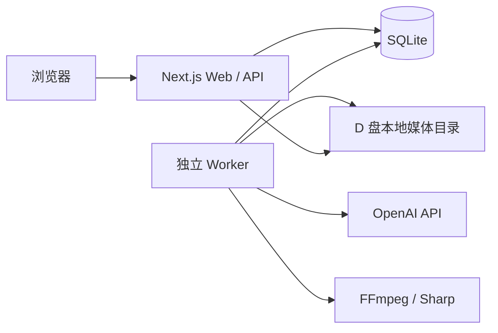

# 单机架构

## 组件

- Web/API：校验输入、管理项目和分镜、创建持久任务、提供受控上传和下载。
- Worker：轮询 SQLite 任务表，调用 OpenAI，生成 SVG、字幕、音频与 MP4。
- SQLite：项目、分镜、素材元数据、任务、事件和渲染结果的唯一状态真相。
- 本地媒体目录：保存用户上传和生成文件；数据库仅保存相对对象键。

## 关键约束

1. Web 请求不执行完整 FFmpeg 渲染。
2. 单机只运行一个 Worker，按顺序处理任务。
3. 领取任务使用带旧状态条件的更新，避免重复领取。
4. Worker 重启时把遗留 `RUNNING` 任务改为 `RETRYING`。
5. 所有媒体路径必须位于 `LOCAL_STORAGE_DIR` 内。
6. OpenAI 密钥只在 Worker 服务端读取。
7. 生成结果必须校验 project revision，过期任务不能覆盖新版本。