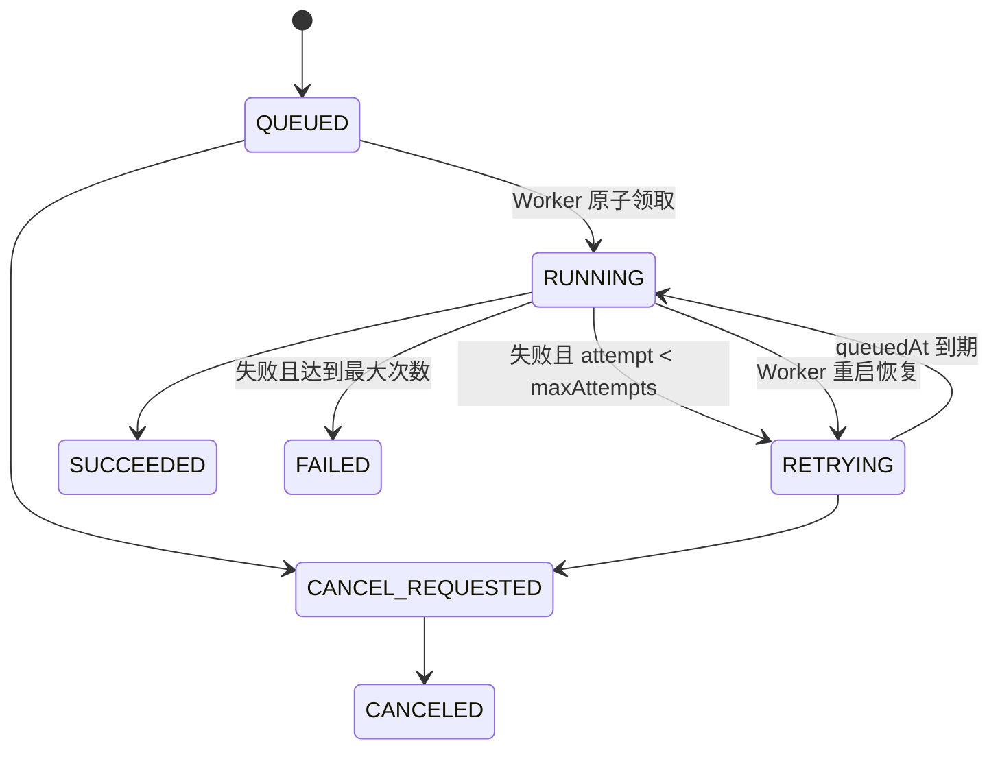

# 本地任务状态机

## 规则

- API 创建 `GenerationJob` 后立即返回 202。
- Worker 每 600ms 查询一个到期的 `QUEUED`/`RETRYING` 任务。
- 领取时同时把状态改为 `RUNNING` 并增加 `attempt`，初始化失败也会计数。
- 重试采用指数退避，最长 30 秒；默认最多三次。
- 进度、错误码、清理后的错误消息和事件都写入 SQLite。
- Worker 启动时恢复遗留 `RUNNING` 任务，避免进程退出导致永久卡死。
- 所有处理器再次校验 project revision，过期任务失败且不得覆盖新数据。